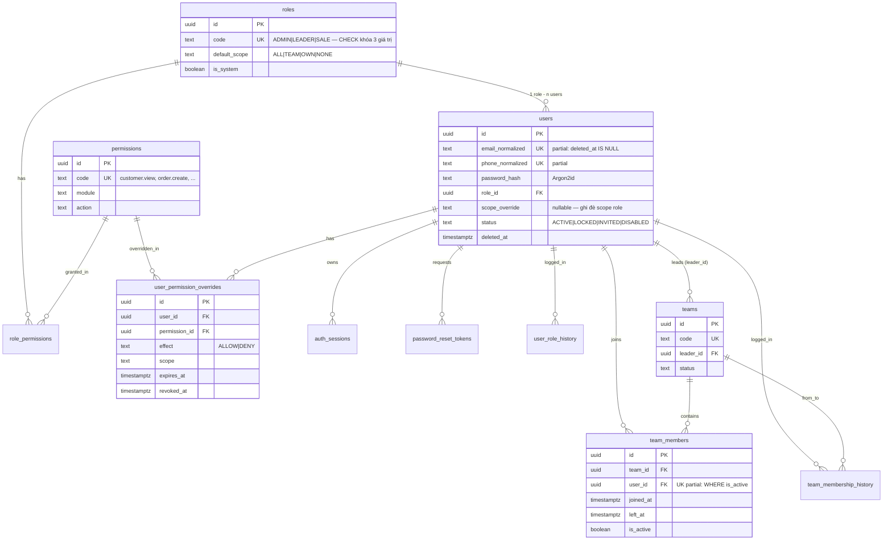
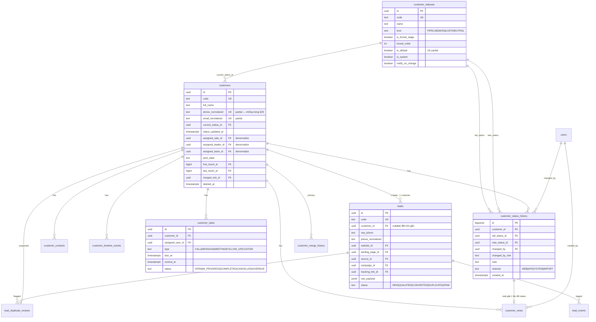
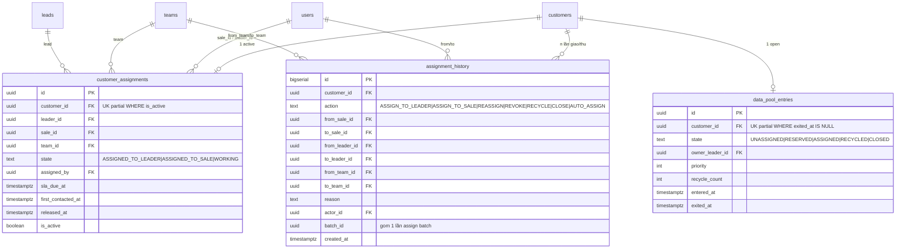
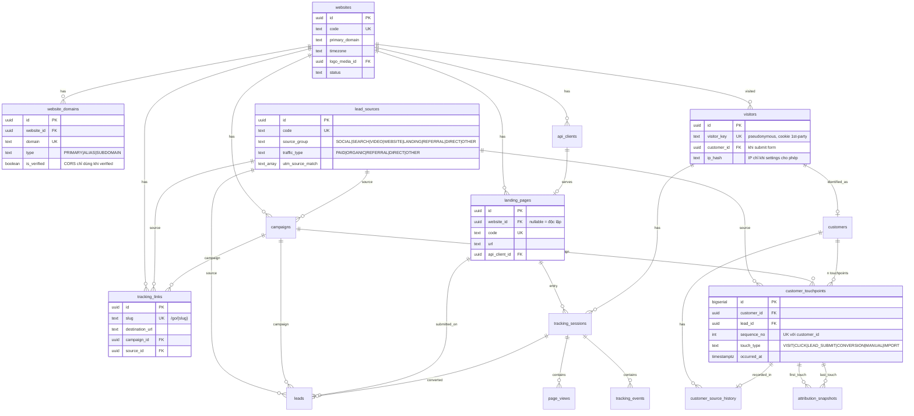
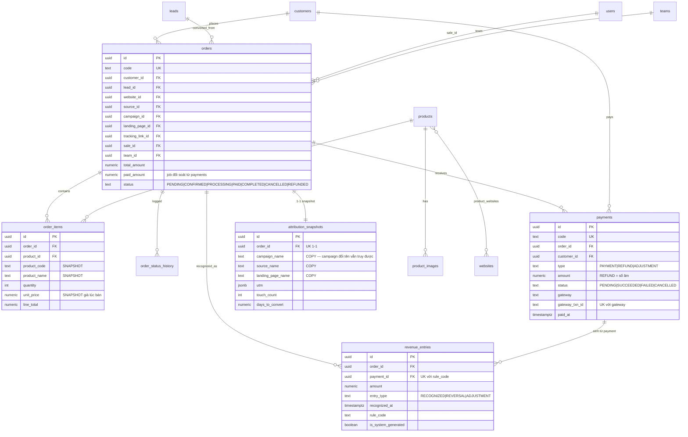
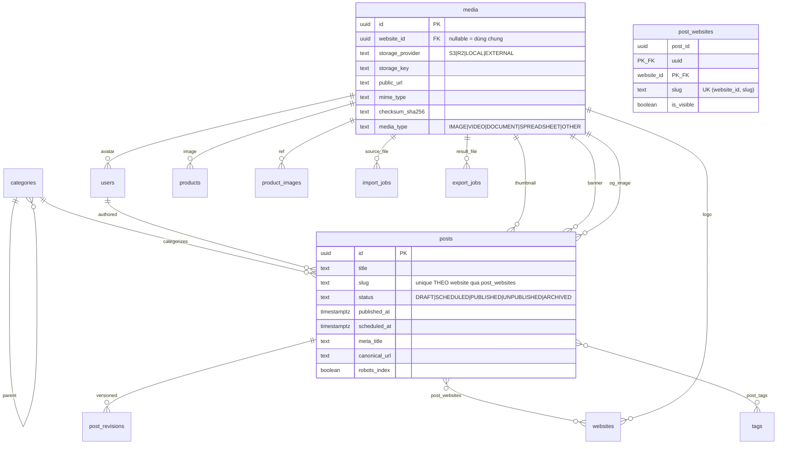

# 06 — ERD (§80 Bước 6)

Chia thành 7 sơ đồ theo domain để đọc được. Ký hiệu Mermaid:
`||--o{` = một-nhiều · `}o--||` = nhiều-một · `||--||` = một-một · `}o--o{` = nhiều-nhiều.

## 6.1 AUTH / RBAC / TEAM



> Sơ đồ trên là bản đọc nhanh. Định nghĩa chuẩn (kèm index, CHECK, partial unique) nằm ở
> `05-database-schema.md`.

## 6.2 CUSTOMER / LEAD / STATUS / TIMELINE



## 6.3 ASSIGNMENT / DATA POOL



## 6.4 WEBSITE / MARKETING / TRACKING / ATTRIBUTION



## 6.5 SALES / BILLING



## 6.6 CMS / MEDIA



## 6.7 INTEGRATION / EVENT / AUDIT / IMPORT-EXPORT

```mermaid
erDiagram
    api_clients ||--o{ api_keys : issues
    api_clients ||--o{ webhooks : owns
    api_clients ||--o{ integration_logs : logged
    api_clients ||--o{ idempotency_records : scoped_by
    api_clients ||--o{ leads : submitted_via
    websites ||--o{ webhooks : scoped_to
    webhooks ||--o{ webhook_deliveries : delivers
    outbox_events ||--o{ webhook_deliveries : triggers
    integrations ||--o{ integration_logs : logged
    api_keys ||--o{ integration_logs : used_in
    notification_rules ||--o{ notifications : produced
    users ||--o{ notifications : receives
    users ||--o{ audit_logs : acted
    api_clients ||--o{ audit_logs : acted
    users ||--o{ import_jobs : created
    import_jobs ||--o{ import_rows : has
    import_jobs ||--o{ import_errors : has
    import_rows ||--o{ import_errors : detail
    users ||--o{ export_jobs : created
    settings ||--o{ settings_history : versioned

    api_keys {
        uuid id PK
        uuid api_client_id FK
        text key_prefix UK "tra cứu nhanh"
        text key_hash "KHÔNG plaintext"
        text key_last_four "hiển thị UI"
        text_array scopes "lead:create, customer:read,..."
        int rate_limit_per_minute
        timestamptz expires_at
        timestamptz revoked_at
        uuid rotated_from_id FK
    }
    webhooks {
        uuid id PK
        text direction "INBOUND|OUTBOUND"
        text url
        text_array event_types
        bytea secret_enc "HMAC signature"
        int max_attempts
        int consecutive_failures "tự PAUSE khi vượt ngưỡng"
    }
    webhook_deliveries {
        bigserial id PK
        uuid webhook_id FK
        uuid event_id "UK với webhook_id — không gửi trùng"
        int attempt_count
        text status "PENDING|IN_FLIGHT|DELIVERED|FAILED|DEAD_LETTER|CANCELLED"
        int response_code
        timestamptz next_retry_at
    }
    outbox_events {
        uuid id PK
        text event_type
        text aggregate_type
        text aggregate_id
        jsonb payload
        text status "PENDING|PROCESSING|PROCESSED|FAILED|DEAD_LETTER"
        int attempt_count
        timestamptz available_at
    }
    idempotency_records {
        uuid id PK
        text idempotency_key "UK (client|user, key, endpoint)"
        text request_hash "SHA-256 body"
        text state "IN_PROGRESS|COMPLETED|FAILED"
        int response_status
        jsonb response_body
        timestamptz expires_at
    }
    audit_logs {
        bigserial id PK
        uuid actor_user_id FK
        text actor_name "SNAPSHOT"
        text action
        text module
        text entity_type
        text entity_id
        jsonb old_values "đã redact"
        jsonb new_values
        text channel "WEB|API|SYSTEM|IMPORT|JOB"
        uuid correlation_id
    }
```



## 6.8 Quan hệ trọng yếu — diễn giải bằng chữ (§58)

**Chuỗi nghiệp vụ chính**
```
users ──(role_id)──► roles                        1 user = 1 trong 3 role
users ──(team_members)──► teams                   Leader/Sale thuộc team, có lịch sử
customers ──(customer_assignments, is_active)──► users(sale/leader)   1 active
customers ──(assignment_history)──► *             n lần giao/thu, append-only
customers ──(current_status_id)──► customer_statuses                  trạng thái hiện tại
customers ──(customer_status_history)──► *        toàn bộ lịch sử, append-only
customers ──(leads)──► n leads                    1 người có nhiều lần bày tỏ quan tâm
customers ──(orders)──► order_items ──► products
orders ──(payments)──► revenue_entries            tiền → ghi nhận doanh thu
orders ──(attribution_snapshots)──► 1-1           bối cảnh conversion đóng băng
```

**Chuỗi marketing**
```
websites ──► website_domains (CORS/định danh request)
websites ──► landing_pages ──► api_clients ──► api_keys
lead_sources + campaigns ──► tracking_links (/go/{slug})
visitors ──► tracking_sessions ──► page_views / tracking_events
tracking_sessions ──(converted_lead_id)──► leads
customers ──► customer_touchpoints (sequence_no 1..n) ──► first/last touch
```

**Chuỗi tích hợp**
```
Domain change ──► outbox_events (cùng transaction)
outbox_events ──► webhook_deliveries ──► external system (retry/backoff/dead-letter)
outbox_events ──► notifications (qua notification_rules)
mọi thay đổi quan trọng ──► audit_logs (cùng transaction)
```

## 6.9 Điểm cần chú ý khi đọc ERD

1. **`customers.assigned_*` và `customers.current_status_id` là cache**, không phải nguồn sự
   thật — nguồn là `customer_assignments` / `customer_status_history` (xem `05a` mục 2).
2. **Không có FK từ `page_views`/`tracking_events` sang `tracking_sessions`** trong DDL vì
   hai bảng đó partition và write-heavy; toàn vẹn được bảo đảm ở tầng ứng dụng. Nếu bạn muốn
   FK cứng, phải bỏ partition hoặc thêm FK theo từng partition.
3. **`attribution_snapshots` cố tình lưu cả FK và tên dạng TEXT** — trùng lặp có chủ đích để
   Order truy ngược được ngay cả khi campaign/landing bị đổi tên hoặc archive (§74).
4. **`leads.customer_id` nullable** trong khoảnh khắc ingest (trước khi dedupe xong), sau đó
   luôn có giá trị. Job đối soát sẽ báo nếu còn lead treo.
